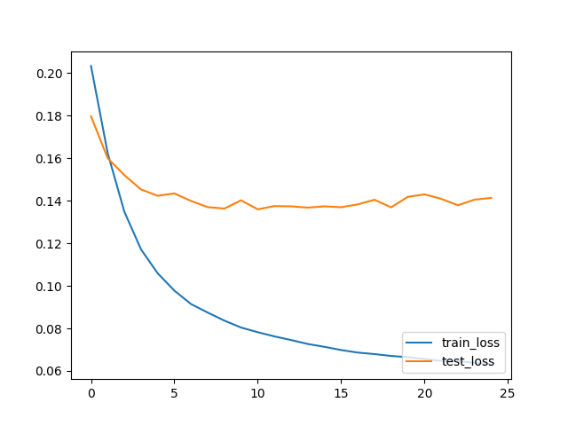

a neural net evaluation function for playing chess 

paper - https://www.researchgate.net/publication/322539902_Learning_to_Evaluate_Chess_Positions_with_Deep_Neural_Networks_and_Limited_Lookahead 

The MLP architecture from this paper has been implemented

architecture:-

773 -> 1048 -> 500 -> 50 -> 1

inputs to the network are encoded bitboards flattened to a vector of len 773
output is a single scalar probability of white winning the board.

working:-

The extractor module parses chess pgn files and encodes each random game position into a 773 sized vector. A dataset is prepared for positions won by black and white. The model is trained to fit the data for 25 epochs.

 